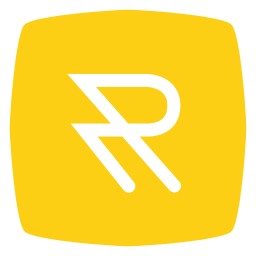

  
  
Things that Riveto Nerds need to know behind the curtains 😎 

  
Riveto 2017 - 2025 with 💛 

    

# Riveto Development Documentation
Do consider this as THE MAIN source of Thinking about how you should see yourself in relation to Riveto as someone who is working on any aspect of this project.

## Core Role of Riveto

We believe by enhanced learning through science and technology we can make a difference in human life quality. Riveto's core role in its users' life is enhanced learning. Notice we are referencing two areas that might seem the to be the same at first sight, but it is critical to know the specific definition of the concepts we are communicating:

1. **Science**: like neuroscience, behavioral science, and related research about learning in an expansive selection of fields.
2. **technology**: the use of techs like social media and developing a web application etc. to deliver the core role of Riveto

> Please understand that the content that you are exposed to behind the scenes of Riveto and especially in this repository is held as "private business assets" based on the second part of the third chapter of the IRI social rules and article number 10 of national social rules mostly referred to as free-trade policy. You are responsible for keeping it private. DO NOT disclose any material or ideas about Riveto to anyone. The only exception is the current team that you are assigned to and your supervisors. The disobedience of this concern is a subject of legal action. If you do not consent to this subject please talk to your supervisor immediately.

## Timeline

Since Riveto is not a project, we do not have a specific overall timeline. It's more like milestones that you will be addressed by your supervisor.

> Riveto is **A lifetime foundation-like business that holds itself responsible for social challenges like the life quality of the citizens of the world.** Such a thing is not a goal or a milestone that can be reached, it is a value letting us to a path that might last more than us.

## Our Story and Vision

Riveto started in the summer of 2017 and as I am writing this, in the second week of 2025, we have been living in Iran on a bad corner of history. Honestly, it is sometimes really hard to see the future when the current short-term challenges of living in Iran, make it almost impossible to have a stable progression. We are experiencing a minimum inflation of 100% each year on average, which the current government understandably hides from international media, We had 3 national protests since we started Riveto. They led to the murder of thousands of women, teenagers, and children on the streets of our country and the arrest of tens of thousands more.\
We are imagining a world in which you can learn effectively. What you learn changes your behavior and functioning in life palpably. You will grow consistently and flourish competently. It's possible to improve yourself with a clear, testable science-based approach. The fact that nobody invested time and money in researching and creating tools to make such a world possible for you, does not mean that it ain't possible. Those who learn it, settle in life and move forward in peace. You do not need willpower, power of thought, motivation, positive thinking, or in most cases essentially an expensive therapist to grow. Numbing your mind with alcohol, drugs, working too much, toxic relationships, putting on masks, perfectionism, avoiding, waiting for others to save you and such unconscious defense mechanisms to run away from yourself, your environment, and the people around you is not the only way. Exploration and deep challenges that are as soothing and satisfying as numbing yourself if not more pleasurable and addictive. This is also possible, only you have been in a world that wasn't designed the way that you could choose it. They didn't teach you at school when you were a kid so you don't know know it. They overload your cognitive capacity with news, creating war and poverty and then broadcasting it to you constantly disabling your sense of attachment and sympathy to other humans while you are not the one who should be responsible for such things that is basically why we have governments, we should focus on living but we are consistently facing with things that you can not do, giving you so-called free social media to give you free speech and better communication while they enslaved you in a prison of isolation where you don't have the change to live a real life with real human communication where you naturally learn skills. They made money such a big problem that you have no time left to even consider other currencies in life. They permitted the production of foods that kill you. They made the world unsafe in all possible elements so that you can not experience living the pure flow of life, these passing moments of being. They teach you right and wrongs that are superhuman. The standards that only might be possible with millions of dollars in cinema and untrue masks on social media. Pursuing is like trying to catch the wind. You don't need them, because they are not real, they seem to be happiness and satisfaction, but real life is messy and has no rules or pre-planning. It happens naturally and is fundamentally uncontrollable. Now, Imagine a world where its citizens know how their brains work, and can acquire not the knowledge but the required mastery to live. To create a life they truly desire and hope for inside that is pure and simple and possible. We never wanted most of what they are teaching us we need. Imagine living in a world where its people apprehend the instruments of human connection, understand each other plainly, and turn any interaction into a supportive and nourishing experience that will eventually lead to real human-like communities in which people truly see, interact, hear, feel, touch, and live. More in person and the real world.
Imagine a world where We have personal adaptable boundaries tightly relatable to our values and the exact time, no boundaries to experience life to engage with humans and nature. In Riveto we have been researching every single day for years in a country that is honestly collapsed in all elements of society and governance. In such circumstances, we chose to dedicate our youth to private research when no university had any funding for such concerns. No professors shared the same long-term vision. They simply said it was not possible. No person was interested in helping us move forward. It was too boring for them. They simply said it wasn't worth the effort, think about yourself and it would not change anything. It was strange because it was as if everybody always had the answers to all the questions. We were those who researched the answer not answering them based on our life experience, emotions, or thin air. Doing this in a wrecked society trapped inside a dysfunctioning governance, turned us into entrepreneurs because we were creating value and also needed money to move forward, we learned how to make money, sustain a business, and communicate effectively with thousands of people in several communities facing challenge after challenge after challenge. Now that over a decade has passed and Riveto has been official for more than 7 years, only now and after all these years we are ready to slowly talk and publish publicly.
Now that you have an understanding of our story, it is easier to clarify why Riveto is a lifetime topic for us. We did not design the path that led us here, we have one purpose, offer you the fruits of this 11-year-old tree. It's beautiful, to live in peace with yourself and others around you while being capable of managing your life to a path in which you can live meaningfully and challenge to grow consistently. It is a life worth living.

It is not enough to know, you need mastery.Mastery happens by learning and learning is not understanding.Learning is verified by the real changes in your life.No change, no learning.It is not about the quality of the lecture of the presenter or the writer.Life is not a specified clear course like learning math in school.It is different for each person, unique.People have the same questions but need different personalized answers to learn the same thing.The world is changing and this is the time for a new big thing.If I teach you I can't be sure that it will make life worthwhile for you or better.

**We help you learn what helps you live better**.\
Sincerely, Mostafa Nasiri\
Founder of Rivero
