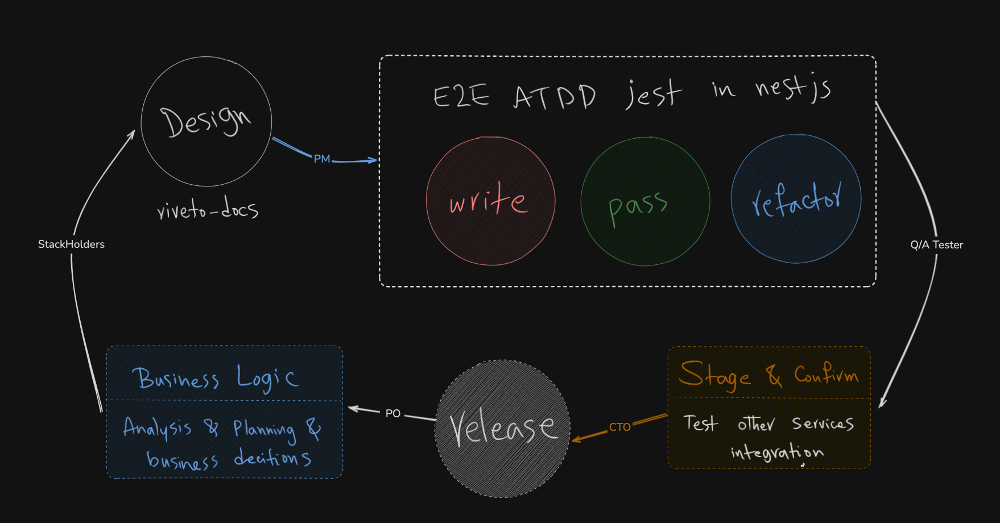

# Riveto CI/CD Instruction

this is basically how we approach team work in Riveto dev. The methodology in Riveto for Development of the software is ATDD. To Apply it follow this Guideline.

based on the image above, DO FOLLOW this instruction:
1.  This is the Initiation of EVERYTHING in RIVETO! The necessary features and changes first will be decided in the management. 
    -  this means nothing changes without the directive of the management level. This includes CEO, CTO, PO.
2. Design is the Second part of ATDD. After 1st step, We first will update this repo's documentation [Riveto Documentation Repository](../README.md) and then and only then will proceed.
3. We turn the design into the E2E test. if you are not familiar please talk to your supervisor since this is an important matter.
4. We go through the Staging and testing before release.
5. The CTO will attempt to release the staged version of the application.

> You are to follow this instruction at any circumstances. 

